# ACM ICPC Analytics

The ACM ICPC World Finals is often referred to as the Olympics for programmers. Intrigued by this renowned competition, I delved into its history on Wikipedia and discovered that it began in 1970 at Texas A&M University, where participants used Fortran to solve problems. As I continued to explore, I came across the startling fact that since 2000, only teams from Russia, China, and Poland have won the ICPC world finals, with the exception of 2022. This piqued my interest, and I set out to unlock insights about this competition using this [dataset](https://www.kaggle.com/datasets/justinianus/icpc-world-finals-ranking-since-1999?select=icpc-2019.csv) I found on Kaggle. Big thanks to [Hoang Le Ngoc](https://www.kaggle.com/justinianus) for putting together and maintaining this awesome dataset!

Thanks to the knowledge and skills I acquired during the [Data Engineering Zoomcamp](https://github.com/DataTalksClub/data-engineering-zoomcamp) hosted by [DataTalks.Club](https://datatalks.club/), I was able to create this project. This course introduced me to numerous open source tools in the data domain, and I was thrilled to put my newfound abilities to the test.

## Technologies

During the development of this project, I utilized various technologies that were covered in the Data Engineering Zoomcamp.

1. Google Cloud Storage: was used as the data lake
2. Google BigQuery: was used as the data warehouse
3. Google Dataproc: for executing spark jobs
4. Google Looker Studio: for building an interactive dashboard
5. Google Cloud Compute: for hosting a private instance of Prefect
6. Terraform: for provisioning the resources on google cloud

### Project Structure

This project contains the following directories:

- `images`: contains all the screenshots captured for writing this readme
- `infra`: contains all the Terraform scripts needed to provision resources on Google Cloud
- `prefect`: contains all the Prefect jobs and configurations
- `pyspark`: contains all the Spark jobs used for building dimension tables
- `schemas`: contains the JSON representation of the tables created in Google BigQuery
- `scripts`: contains some handy scripts to make setting up the Prefect server a breeze.

## Architecture

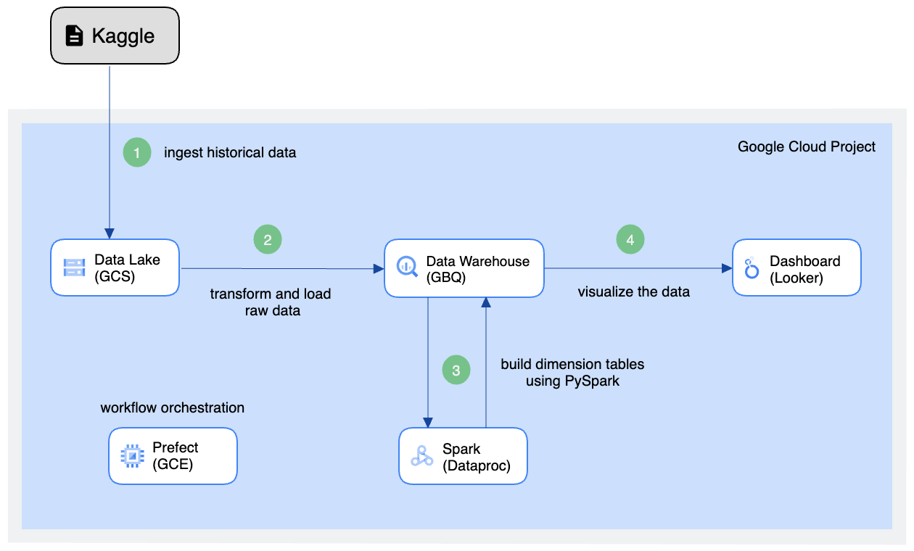

## Setting up the Infrastructure

The traditional methods of building the above architecture in Google Cloud using console UI, gcloud CLI, or REST API are time-consuming and error-prone, especially when it comes to scaling infrastructure. To address this, I used Terraform to provision and decommission infrastructure in a more efficient and manageable way. Terraform is an infrastructure as code (IaC) tool that automates the provisioning of infrastructure resources, allowing for easier management at scale. It is a good choice even for small projects as it allows for cost reduction by destroying cloud resources once the project is completed.

## Workflow

The workflow for this project consists of several stages. Initially, the dataset is fetched from the source, after which it is loaded into Google BigQuery. Following this, dimension tables are created by performing various transformations on the raw dataset using PySpark. Finally, an interactive dashboard can be built using the dimension tables, enabling users to analyze and visualize the data in a meaningful way.

### Orchestration

To orchestrate all the tasks in the workflow, I have chosen to use Prefect. Prefect is a modern data workflow management system that allows for the creation, scheduling, and monitoring of complex data pipelines. It offers features such as error handling, task retries, and dynamic dependencies, making it an ideal choice for data engineering projects. Additionally, Prefect integrates seamlessly with various cloud platforms, including Google Cloud, which I used for this project. By using Prefect, I was able to create a reliable and scalable workflow that automates the various tasks involved in processing the dataset and building the dashboard.

Sequence of manual task execution:

1. etl_parent_gh_to_gcs
2. etl_parent_gcs_to_gbq
3. start_pyspark_jobs

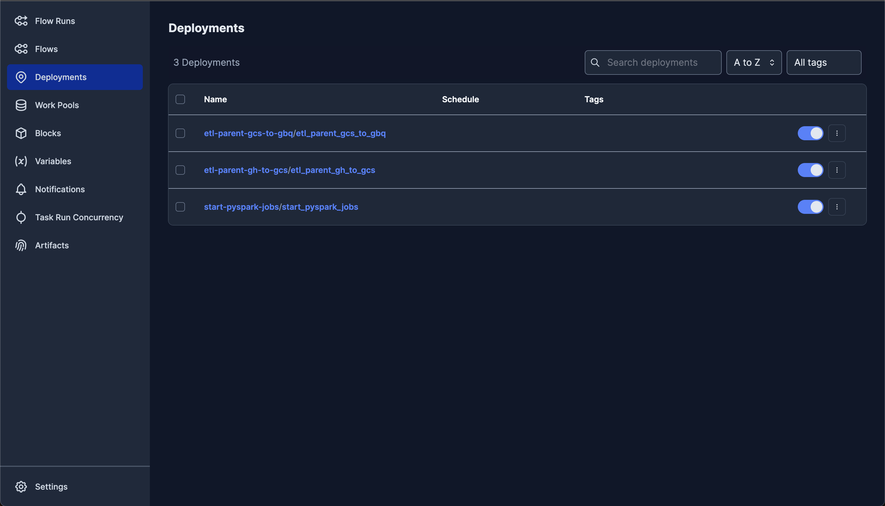

| Flows                        | Flow Runs                            |
| ---------------------------- | ------------------------------------ |
| 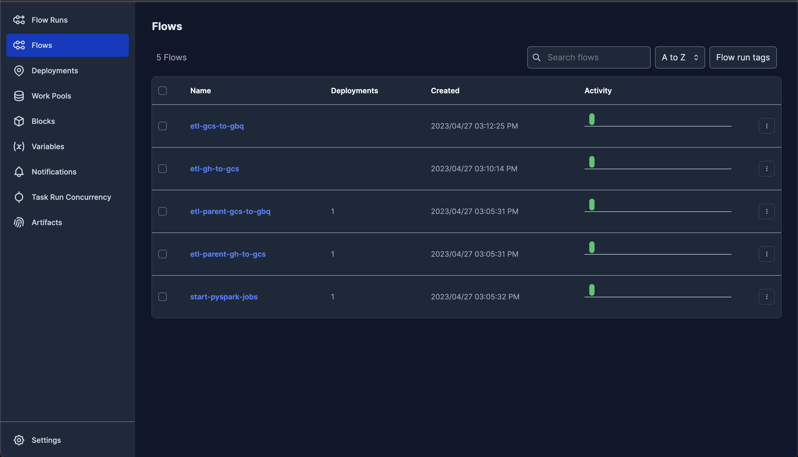 | 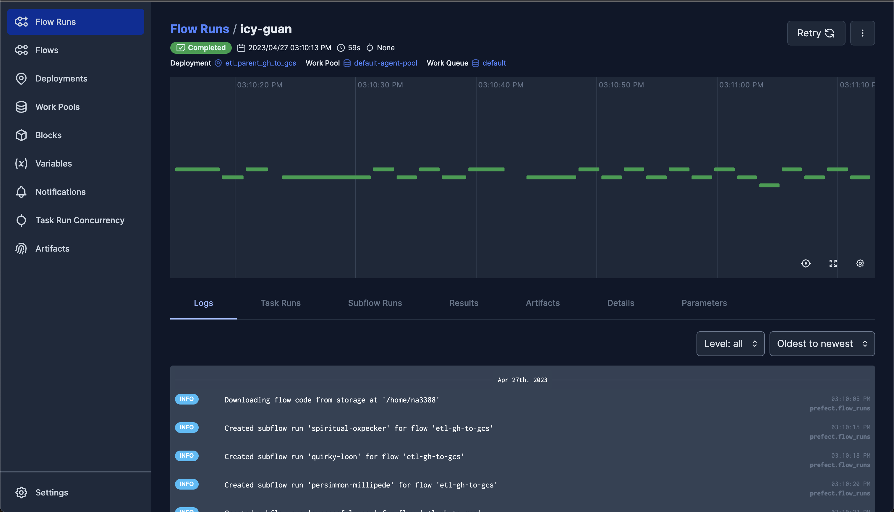 |


#### Configuration

To simplify the sharing of information among flows, I utilized Prefect blocks to securely and easily manage the configuration related to my project. Prefect blocks are reusable building blocks that allow for the creation of modular, shareable, and easily configurable code. These blocks encapsulate specific functionality and are used to create more complex flows. They can also be parameterized to allow for easy configuration and reuse. In my project, I used Prefect blocks to store the necessary credentials for accessing my Google Cloud services, making it easier to maintain and manage this sensitive information.

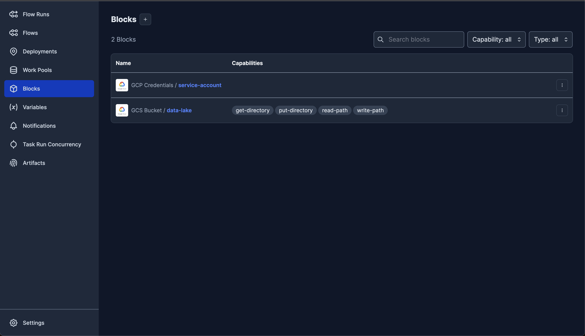

To ensure the execution of tasks, Prefect uses agents, which are responsible for running the flows. If an agent is not running, the flows will remain in the scheduled state. To create the default agent, a startup script is executed as part of provisioning the VM for Prefect server. This script contains the necessary configurations and instructions to set up the default agent. By default, Prefect uses the LocalAgent, which runs the tasks locally on the machine where the agent is running. However, it's possible to use other agents like the DaskAgent, which allows distributed computing.

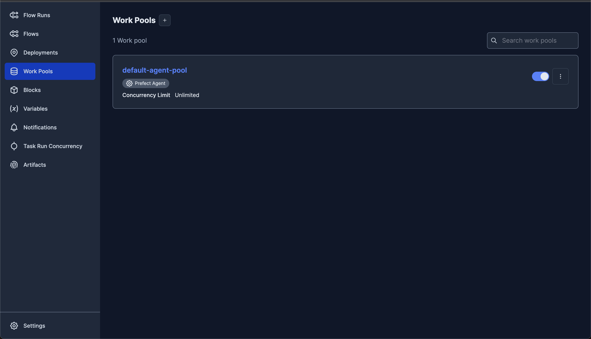

### Data Lake

In the workflow of this project, the dataset is initially fetched from Kaggle and stored in a bucket in Google Cloud Storage, which serves as a data lake. A data lake is a centralized repository that allows for the storage of structured and unstructured data in its native format. Google Cloud Storage is a great choice for a data lake because of its durability, scalability, and low cost. Additionally, it seamlessly integrates with other Google Cloud services such as BigQuery, which is used as the data warehouse in this project.


### Data Warehouse

After the data has been stored in the data lake, the Prefect job `etl_parent_gcs_to_gbq` creates a new table in BigQuery named `raw_data` and appends all the data from the multiple years of CSV files stored in Cloud Storage into this table. A data warehouse is a central repository of structured, processed, and cleansed data that is optimized for analytical queries and reporting. It is designed to support business intelligence (BI) and decision-making processes by providing a consistent and reliable source of data. Google BigQuery is a good choice for a data warehouse because it provides fast and scalable data processing, efficient data ingestion and storage, and powerful querying and analysis capabilities.

| Table Size                               | Table Info                           |
| ---------------------------------------- | ------------------------------------ |
| 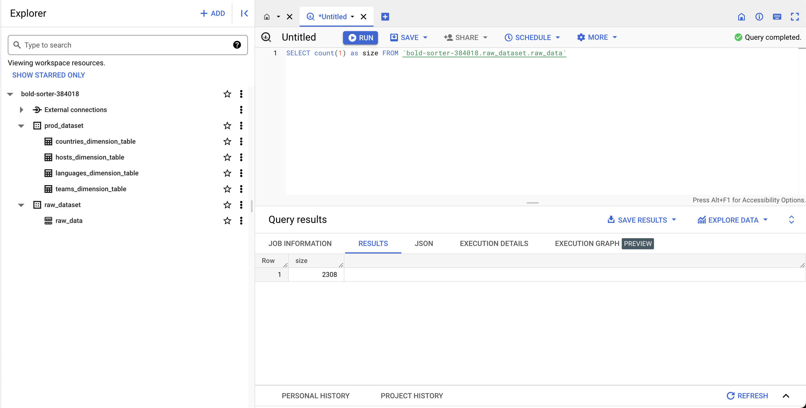      | 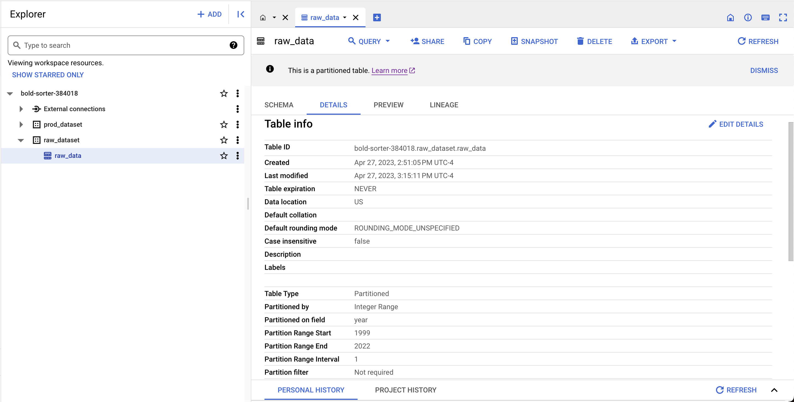  |

After the `raw_data` table is available, we transform and build dimension tables over it to support our data visualization. Dimension tables contain descriptive attributes that provide context and help organize the data in a meaningful way. For example, in a retail dataset, the `product`dimension table would contain attributes such as `product_id`, `product_name`, `brand_name`, and `category_name`.

<p align="center">
  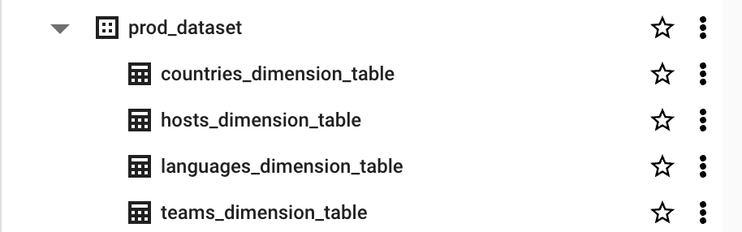
</p>

To improve query performance, I partitioned all tables in Google BigQuery (GBQ) based on the year column. Partitioning is a technique that divides a large table into smaller, more manageable parts based on specific column(s). By doing so, queries can be processed faster because only the relevant partitions need to be scanned. 

### Dashboard

Finally, we leverage the dimension tables to create an interactive dashboard that provides insights about the data. Business Intelligence (BI) tools are used to create these dashboards, enabling users to analyze data and visualize it in a meaningful way. BI tools can connect to data sources, transform data, and display it in various formats such as tables, charts, and graphs.

The dashboard showcases some of the insights that can be gained from the data and provides an example of the types of analysis that can be performed with Looker Studio. Here are some screenshots of the dashboard, and you can also make a copy of the dashboard yourself using this [link](https://lookerstudio.google.com/s/oWO5PzCrxTU). This makes it easy for anyone to replicate the project and gain insights into the types of analysis that can be performed with Looker Studio.

_Note_: Make sure you change the data source to the respective tables in your data warehouse (GBQ) after creating the copy of the dashboard

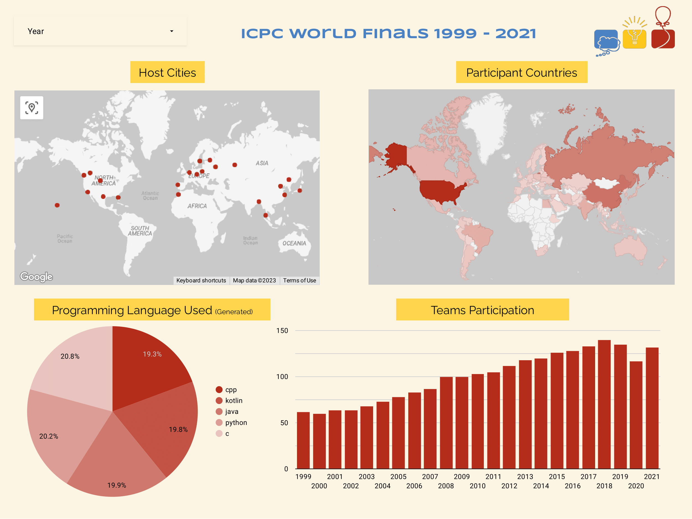

| 1999 - 2011                          | 2012 - 2021                        |
| ------------------------------------ | ---------------------------------- |
| 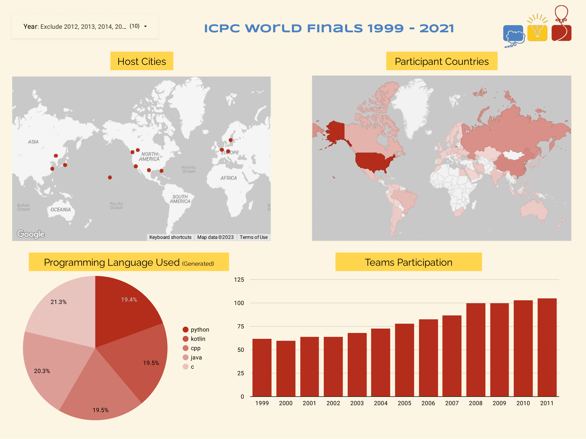 | 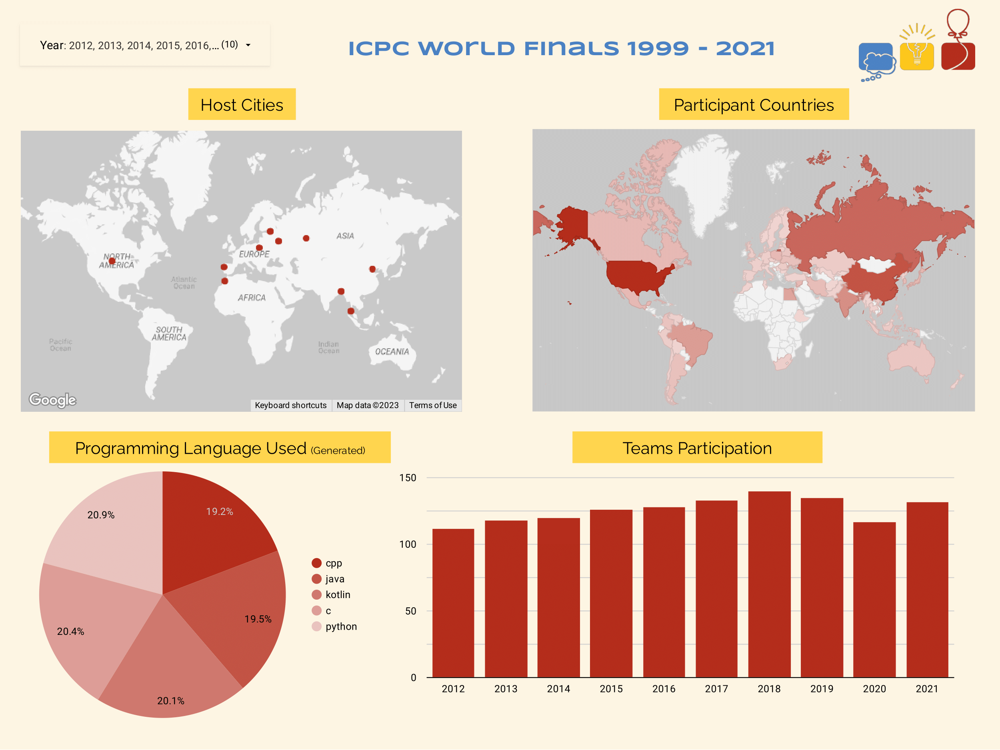 |


## Deployment

Before you can deploy this project, make sure that you have installed `gcloud` and `terraform` on your machine. The following screenshot shows the versions of these tools during the development of this project:

<p align="center">
  
</p>

To deploy the project, you need to authenticate with `gcloud` first. 

```bash
$ gcloud auth application-default login
```

After that, create a new project either through the CLI or the console UI. Also, make sure to edit the location of the CSV files in the `etl_gh_to_gcs.py` file.

Next, navigate to the `infra` working directory and create a `terraform.tfvars` file. Add values for all the variables mentioned in `variables.tf`. Here is the template you can edit:

```terraform
project_id = ""
region = ""
zone = ""
bucket_data_lake = ""
account_id = ""
```

Finally, run `terraform apply`. Make sure not to delete the state files created by Terraform; otherwise, you won't be able to destroy the resources created in Google Cloud properly. Expected time to provision and setup all the resources in Gcloud is somewhere around 8-12 mins.

Once the deployment is complete you can access the prefect server through the url provided as the output at the end. Trigger the jobs in the order mentioned in the workflow. Create a copy of the dashboard and update your data sources.

_Note_: Re-run the `terraform apply` if you get errors related to enabling APIs in Gcloud

## Challenges

During my work on this project, I encountered several challenges, which I managed to overcome. These included:

1. Issues with the kaggle package available in Python. The package did not work correctly, and I faced problems with authentication and fetching the 2019-2021 dataset from Kaggle. To solve this issue, I created a temporary GitHub repository and uploaded all the data there. However, I do not recommend using this package for now, as it has several open issues on GitHub and may lead to errors in your data pipelines.

2. Automating the setup of Prefect on Google Compute Engine. To achieve this, I used the remote-exec provisioner in Terraform to execute the script. However, I faced some permission issues at first since remote-exec executed the script with root privileges. I later resolved this problem by uploading all the necessary files to VM using the file provisioner in Terraform and using remote-exec solely to execute the script on the server.

3. Difficulties in setting up Google Dataproc using Terraform. The provider documentation could be updated to address this issue. To solve this problem, I created a fake Dataproc instance and used the generated REST API payload to model it in Terraform.

4. Updating the BigQuery connector in the Dataproc cluster was also challenging. However, I was able to solve this issue using the same approach as mentioned above.

Overall, these challenges taught me valuable lessons in problem-solving and helped me to develop a more robust skill set for future projects.

## Improvements

Here are a few improvements that I will be working on to enhance this project:

1. Remove Prefect: Although Prefect is a useful tool, I plan to migrate the flows to Google Composer. Google Composer is a fully managed Airflow instance that provides a more robust solution than Prefect and will save time when scaling the current Prefect instance.

2. Incorporate more visualizations: The dataset contains more insights than currently visualized on the dashboard. I plan to add more visualizations to better showcase the data.

3. Consider Dataflow: As the dataset is not too large, I can use Dataflow instead of Spark to make data transformations more manageable and cost-effective.

4. Explore additional GCP APIs: I will explore other GCP APIs that can be used to simplify some of the ETL tasks in this project.

5. Create service accounts with granular permissions

## Contributing

If you are interested in improving this project or encounter any bugs, I highly encourage you to open an issue so that I can take a look at it. Even better, you can submit a pull request with your proposed changes. Thank you in advance!

