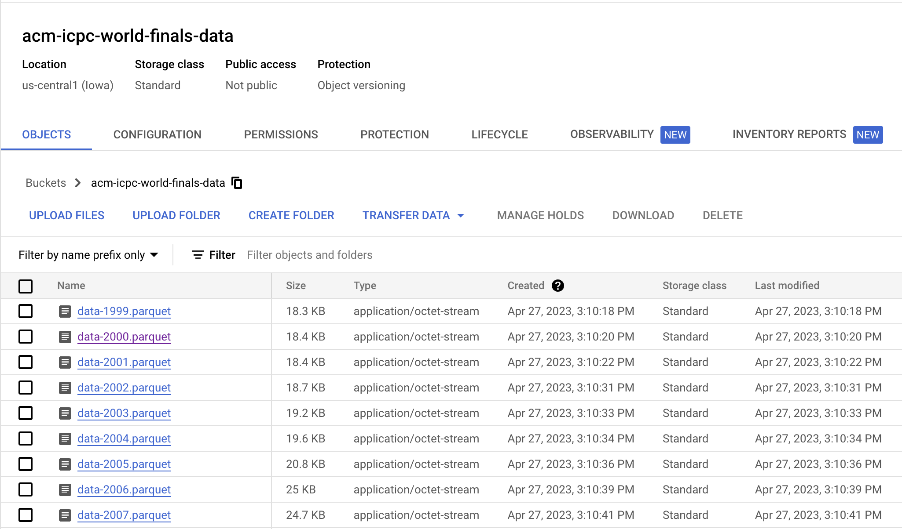

# ACM ICPC Analytics


## Technologies

### Project Structure


## Architecture


## Workflow


### Orchestration


| Flows                        | Flow Runs                            |
| ---------------------------- | ------------------------------------ |
|  |  |


### Configuration


### Data Lake



### Data Warehouse

| Table Size                               | Table Info                           |
| ---------------------------------------- | ------------------------------------ |
|       |   |

<p align="center">
  
</p>

### Dashboard


| 1999 - 2011                          | 2012 - 2021                        |
| ------------------------------------ | ---------------------------------- |
|  |  |


## Deployment

Before you can deploy this project, make sure that you have installed `gcloud` and `terraform` on your machine. The following screenshot shows the versions of these tools during the development of this project:

<p align="center">
  
</p>

To deploy the project, you need to authenticate with `gcloud` first. After that, create a new project either through the CLI or the console UI. Also, make sure to edit the location of the CSV files in the `etl_gh_to_gcs.py` file.

Next, navigate to the `infra` working directory and create a `terraform.tfvars` file. Add values for all the variables mentioned in `variables.tf`. Here is the template you can edit:

```terraform
project_id = ""
region = ""
zone = ""
bucket_data_lake = ""
account_id = ""
```

Finally, run `terraform apply`. Make sure not to delete the state files created by Terraform; otherwise, you won't be able to destroy the resources created in Google Cloud properly.

## Challenges


## Improvements

