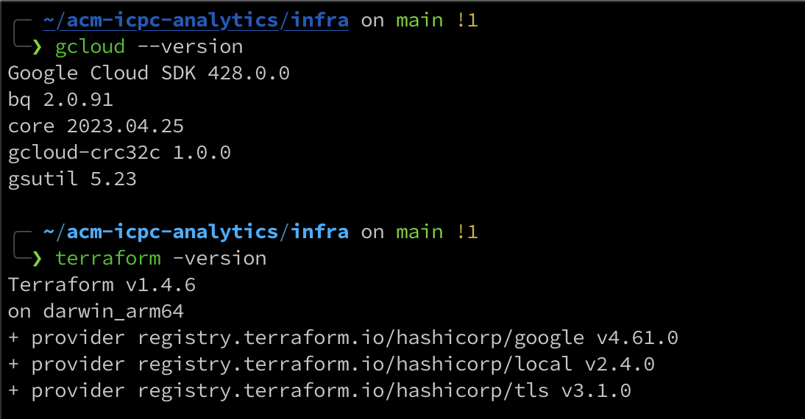

# ACM ICPC Analytics

The ACM ICPC World Finals is often referred to as the Olympics for programmers. Intrigued by this renowned competition, I delved into its history on Wikipedia and discovered that it began in 1970 at Texas A&M University, where participants used Fortran to solve problems. As I continued to explore, I came across the startling fact that since 2000, only teams from Russia, China, and Poland have won the ICPC world finals, with the exception of 2022. This piqued my interest, and I set out to unlock insights about this competition using a dataset I found on Kaggle.

Thanks to the knowledge and skills I acquired during the [Data Engineering Zoomcamp](https://github.com/DataTalksClub/data-engineering-zoomcamp) hosted by [DataTalks.Club](https://datatalks.club/), I was able to create this project. This course introduced me to numerous open-source tools in the data domain, and I was thrilled to put my newfound abilities to the test.

## Technologies

### Project Structure


## Architecture


## Workflow


### Orchestration


| Flows                        | Flow Runs                            |
| ---------------------------- | ------------------------------------ |
|  |  |


### Configuration


### Data Lake


### Data Warehouse

| Table Size                               | Table Info                           |
| ---------------------------------------- | ------------------------------------ |
|       |   |

<p align="center">
  
</p>

### Dashboard


| 1999 - 2011                          | 2012 - 2021                        |
| ------------------------------------ | ---------------------------------- |
|  |  |


## Deployment

Before you can deploy this project, make sure that you have installed `gcloud` and `terraform` on your machine. The following screenshot shows the versions of these tools during the development of this project:

<p align="center">
  
</p>

To deploy the project, you need to authenticate with `gcloud` first. After that, create a new project either through the CLI or the console UI. Also, make sure to edit the location of the CSV files in the `etl_gh_to_gcs.py` file.

Next, navigate to the `infra` working directory and create a `terraform.tfvars` file. Add values for all the variables mentioned in `variables.tf`. Here is the template you can edit:

```terraform
project_id = ""
region = ""
zone = ""
bucket_data_lake = ""
account_id = ""
```

Finally, run `terraform apply`. Make sure not to delete the state files created by Terraform; otherwise, you won't be able to destroy the resources created in Google Cloud properly.

## Challenges


## Improvements

